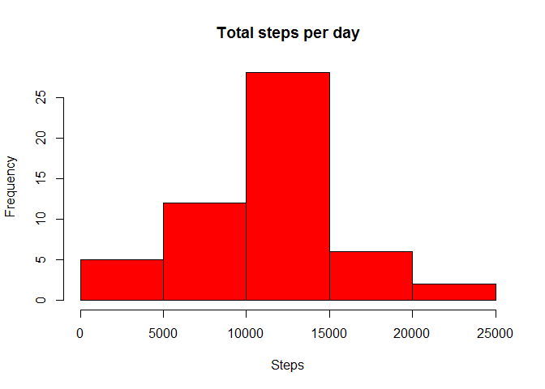
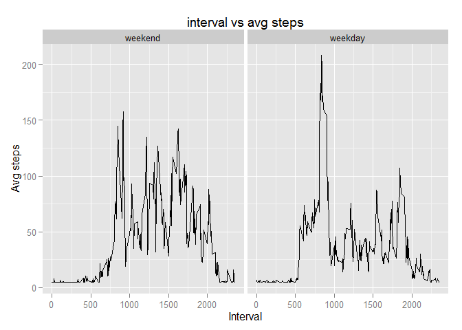
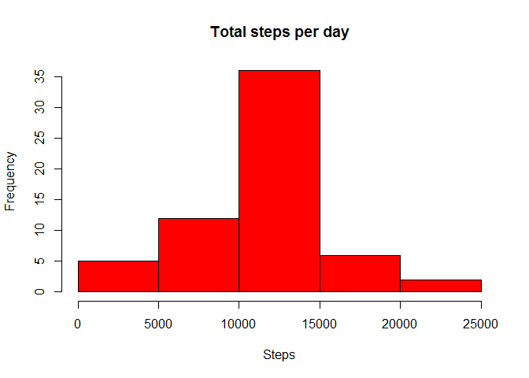
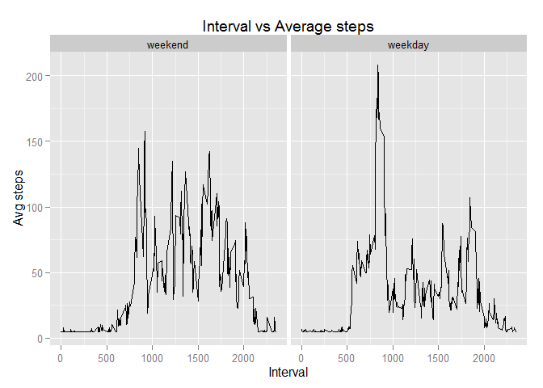

# Reproducible Research: Peer Assessment 1


## 1. Loading and preprocessing the data


```r
ActivityData <- read.table("./repdata-data-activity/activity.csv", sep=",", header=TRUE)

# remove the non complete case data

cleanData <- na.omit(ActivityData)

# get the mean of steps for cleanData
# to be used as replacement for NAs in later stage

mean(cleanData$steps)
```

```
## [1] 37.3826
```


## 2. What is mean total number of steps taken per day?


```r
library(plyr)

# calculate the number of steps for each day

sum_Steps_Daily_Data <- ddply(cleanData, c("date"), summarise,
                      sumSteps    = sum(steps))

# plot the histogram

hist(sum_Steps_Daily_Data$sumSteps, col="red", xlab="Steps", main="Total steps per day")
```

 

The mean of the number of steps taken daily is


```r
mean(sum_Steps_Daily_Data$sumStep)
```

```
## [1] 10766.19
```

The median of the number of steps taken daily is


```r
median(sum_Steps_Daily_Data$sumStep)
```

```
## [1] 10765
```

## 3. What is the average daily activity pattern?


```r
## Average daily pattern

avg_Interval_Data <- ddply(cleanData, c("interval"), summarise,
                      avgSteps = mean(steps))

x1 <- avg_Interval_Data$interval
y1 <- avg_Interval_Data$avgSteps

# plot the time series

plot(x1, y1, type="l", xlab = "Interval", ylab="Average steps per day")
```

 


### In which 5-minute interval, on average across all the days in the dataset, contains the maximum number of steps?

Interval = **835**


## 4. Imputing missing values

### Total number of missing values NAs in original dataset


```r
modified_ActivityData <- ActivityData

# count of NAs is

sum(is.na(modified_ActivityData))
```

```
## [1] 2304
```


```r
## repace NAs with the steps average from the clean data set

modified_ActivityData[is.na(modified_ActivityData[,1]),1] <- mean(cleanData$steps)

# count of NAs after replacement

sum(is.na(modified_ActivityData))
```

```
## [1] 0
```

```r
# total steps per day

sum_Steps_Modified_Daily_Data <- ddply(modified_ActivityData, c("date"), summarise,
                      sumSteps    = sum(steps))

#plot the histogram

hist(sum_Steps_Modified_Daily_Data$sumSteps, col="red", xlab="Steps", main="Total steps per day")
```

 

The mean of the number of steps taken daily is


```r
mean(sum_Steps_Modified_Daily_Data$sumStep)
```

```
## [1] 10766.19
```

The median of the number of steps taken daily is


```r
median(sum_Steps_Modified_Daily_Data$sumStep)
```

```
## [1] 10766.19
```

### Do these values differ from the estimates from the first part of the assignment?

** No changes on the mean value **

** Minor increase (1.19 steps) on the median value **

### What is the impact of imputing missing data on the estimates of the total daily number of steps?

** Minimal impact on the estimates **

## 5. Are there differences in activity patterns between weekdays and weekends?


```r
# the code to create the new factor variable 
# below is following an example from stackoverflow

wkdays <- c('Monday', 'Tuesday', 'Wednesday', 'Thursday', 'Friday')

modified_ActivityData$date <- as.Date(modified_ActivityData$date)

# create factor variable "day"
modified_ActivityData$day <- factor((weekdays(modified_ActivityData$date) %in% wkdays), 
                   levels=c(FALSE, TRUE), labels=c('weekend', 'weekday')) 

# to show that the new factor variable 'day' is created

str(modified_ActivityData)
```

```
## 'data.frame':	17568 obs. of  4 variables:
##  $ steps   : num  37.4 37.4 37.4 37.4 37.4 ...
##  $ date    : Date, format: "2012-10-01" "2012-10-01" ...
##  $ interval: int  0 5 10 15 20 25 30 35 40 45 ...
##  $ day     : Factor w/ 2 levels "weekend","weekday": 2 2 2 2 2 2 2 2 2 2 ...
```

```r
# aggregate average steps based on weekend and weekdays

summary_data <- ddply(modified_ActivityData, c("interval", "day"), summarise,
                      avg    = mean(steps))

library(ggplot2)

# plot the time series

qplot(interval, avg, data=summary_data, facets=.~day, geom=c("line"),
      method="lm", xlab="Interval", ylab="Avg steps", 
      main="Interval vs Average steps")
```

 
