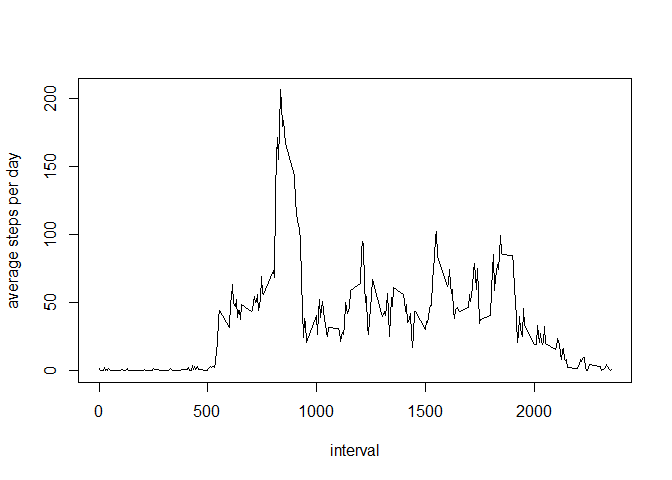

# Reproducible Research: Peer Assessment 1


## Loading and preprocessing the data


```r
ActivityData <- read.table("./repdata-data-activity/activity.csv", sep=",", header=TRUE)

# remove the non complete case data

cleanData <- na.omit(ActivityData)

# get the mean of steps for cleanData
# to be used as replacement for NAs in later stage

mean(cleanData$steps)
```

```
## [1] 37.3826
```


## What is mean total number of steps taken per day?


 

```
## [1] 10766.19
```


## What is the average daily activity pattern?

 

## Imputing missing values


```
## [1] 2304
```

```
## [1] 0
```

 

```
## [1] 10766.19
```

```
## [1] 10766.19
```

```
##          date       sumSteps    
##  2012-10-01: 1   Min.   :   41  
##  2012-10-02: 1   1st Qu.: 9819  
##  2012-10-03: 1   Median :10766  
##  2012-10-04: 1   Mean   :10766  
##  2012-10-05: 1   3rd Qu.:12811  
##  2012-10-06: 1   Max.   :21194  
##  (Other)   :55
```

## Are there differences in activity patterns between weekdays and weekends?

## weekdays and weekends activity pattern

```
## 'data.frame':	17568 obs. of  4 variables:
##  $ steps   : num  37.4 37.4 37.4 37.4 37.4 ...
##  $ date    : Date, format: "2012-10-01" "2012-10-01" ...
##  $ interval: int  0 5 10 15 20 25 30 35 40 45 ...
##  $ day     : Factor w/ 2 levels "weekend","weekday": 2 2 2 2 2 2 2 2 2 2 ...
```

 
